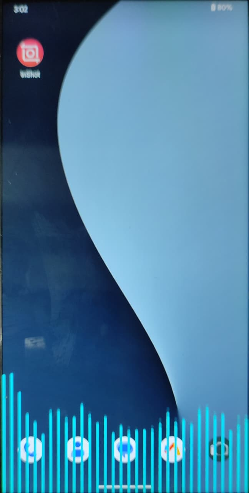
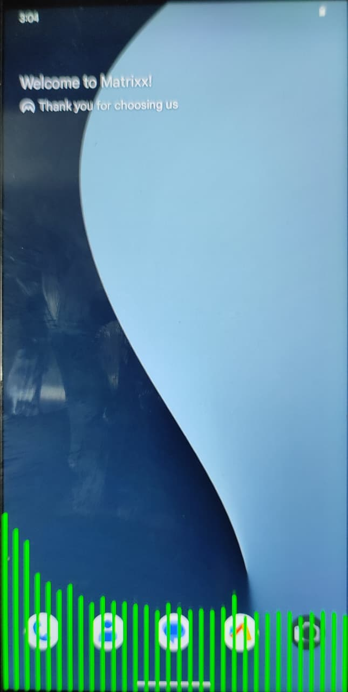
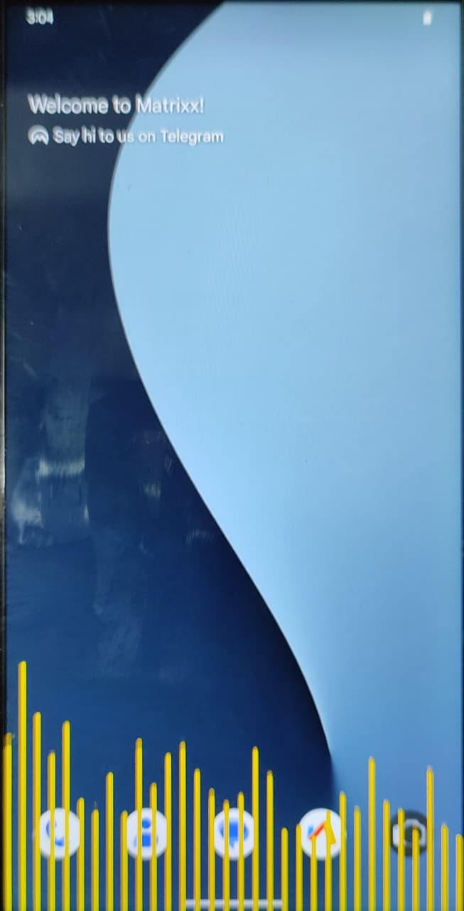
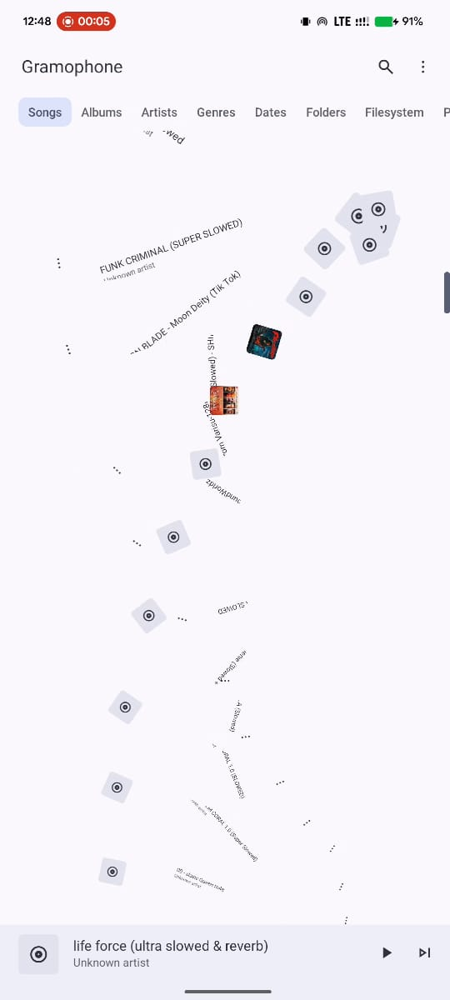
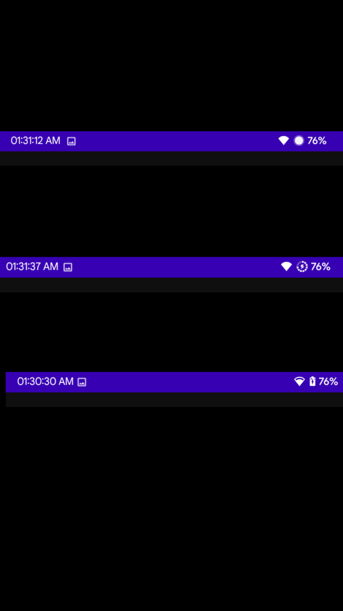
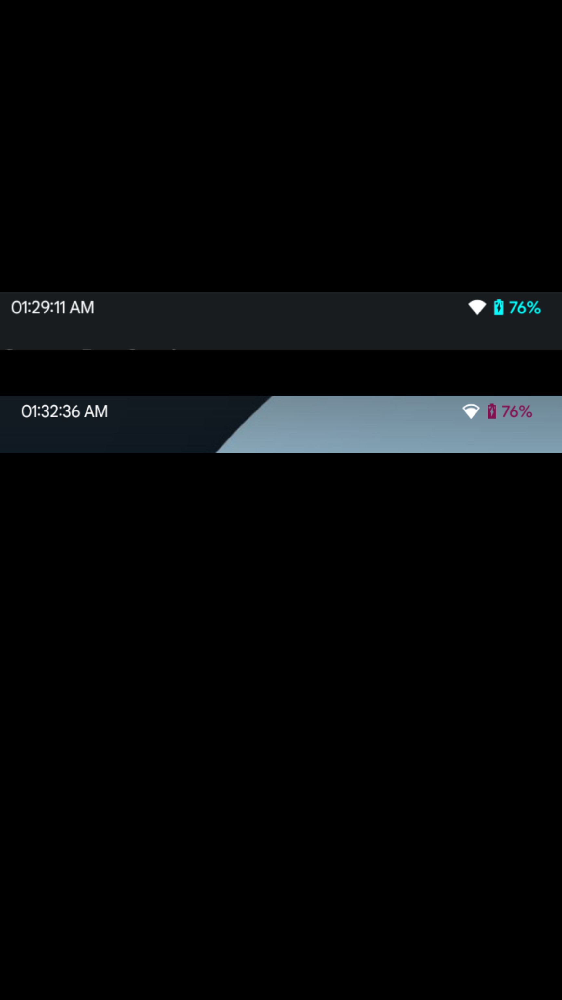

# 🎨 AURA CTRL — The Ultimate LSPosed Module

<h3>Complete Android Customization Suite</h3>

Pulse Animations • Status Bar Tweaks • List Animations • Boot Animations • Video Wallpaper • Gesture Triggers

[📥 Download Now](https://github.com/vaddempudignanesh/AURA-CTRL-LSPosed/releases/download/v2.0/AURA_CTRL_v2.0.apk) &nbsp;&nbsp; [📖 Documentation](#-features) &nbsp;&nbsp; [📹 Watch Demos](#-demo-videos)

---

## 🖼️ **VIDEO WALLPAPER**

Set any MP4 video as your live wallpaper with audio control

<table align="center">
  <tr>
    <td align="center"><b>🎬 Video Wallpaper Example 1</b></td>
    <td align="center"><b>🎬 Video Wallpaper Example 2</b></td>
  </tr>
  <tr>
    <td align="center">
      
    </td>
    <td align="center">
      
    </td>
  </tr>
</table>

---

## 🎬 **BOOT ANIMATIONS**

Contains 35+ boot animations with GIF previews - one-time download saves 200+ MB APK space!

**Row 1: Boot Animation Example 1**

<table align="center">
  <tr>
    <td align="center"><b>Boot Logo</b></td>
    <td align="center"><b>Boot Animation</b></td>
  </tr>
  <tr>
    <td align="center">
      
    </td>
    <td align="center">
      
    </td>
  </tr>
</table>

**Row 2: Boot Animation Example 2**

<table align="center">
  <tr>
    <td align="center"><b>Boot Logo</b></td>
    <td align="center"><b>Boot Animation</b></td>
  </tr>
  <tr>
    <td align="center">
      
    </td>
    <td align="center">
      
    </td>
  </tr>
</table>

> **Note:** All 35+ boot animations are available in the app with live GIF previews before applying!

---
## 🎵 **PULSE ANIMATION**

Audio visualizer that appears on screen edges — works EVERYWHERE! 
✅ Lockscreen • ✅ Homescreen • ✅ All apps • ✅ While charging

<b>Full Customization Available:</b> 
Color • Opacity • Offset • Gradient • Roundness • Top/Left/Right/Bottom edges

<table align="center">
  <tr>
    <td align="center"><b>🎨 Pulse Blue</b></td>
    <td align="center"><b>🎨 Pulse Green</b></td>
  </tr>
  <tr>
    <td align="center">
      
    </td>
    <td align="center">
      
    </td>
  </tr>
  <tr>
    <td align="center" colspan="2">
      <b>🎨 Pulse Yellow</b> 
      
    </td>
  </tr>
</table>

> **Pro Tip:** Disable system built-in pulse for best results! AuraCtrl pulse works everywhere.

---

## 🎬 **LIST ANIMATIONS**

Works on ANY app downloaded from Play Store — system apps, social media, browsers, you name it! 
Choose your favorite app in LSPosed Manager and enjoy stunning animations everywhere.

  

<b>🎨 30+ Customizable Animation Effects:</b> 
DNA Double Helix • Tada • Heartbeat • 3D Flip • Cosmic Burst • Scale & Bounce 
Swirl • Wave • Stretch • Zoom • 3D Sphere • 3D Dice • 3D Diamond • and many more!

> **Tip:** Works best with apps like messaging apps, social media, file managers — anywhere lists appear!

---
## 🔋 **BATTERY CUSTOMIZATION**

Customize your battery icon and percentage text color

  

<b>Available Battery Styles:</b> 
Dotted Circle • Circle • Text Only • Portrait (Vertical) • Landscape (Horizontal)

<b>🎨 Customization Options:</b> 
• Battery Icon Color • Percentage Text Color

> **⚠️ Compatibility Note:** Works perfectly on Android 14-15 across all ROMs. On Android 16, some custom ROMs may have limited support due to SystemUI changes.

---
## 🎨 **BATTERY COLOR CUSTOMIZATION**

Change battery icon color and percentage text color to match your theme

  

<b>✨ What You Can Customize:</b> 
• Battery Icon Color • Battery Percentage Text Color

> **⚠️ Compatibility Note:** Works perfectly on Android 14-15 across all ROMs. On Android 16, some custom ROMs may have limited support due to SystemUI changes.

## 🪄 **ACTIVITY & WINDOW ANIMATIONS**

Customize app opening and closing transitions with <b>60+ animation effects</b>!

<i>Click below to download demo videos and see the smooth animations in action</i>

<table align="center">
  <tr>
    <td align="center"><b>⬅️ Slide Left Animation</b> 
      <a href="Videos/slide-left.mp4">📥 Download Demo Video</a>
    </td>
    <td align="center"><b>⬆️ Slide Up Animation</b> 
      <a href="Videos/slide-up.mp4">📥 Download Demo Video</a>
    </td>
  </tr>
  <tr>
    <td align="center">
      
    </td>
    <td align="center">
      
     </td>
  </tr>
</table>

<b>🎬 60+ Animation Effects Available (Showing 2 as examples):</b> 
Counter Spiral • Accordion Fold • Slow Fade + Slide • Fast Slide & Hold • Micro Bounce 
Jigsaw Fit • Multi Quick Shift • Venetian Blind • Card Shuffle • Domino Fall 
Particle Swarm • Rubber Band Jiggle • Ink Blot • Starfield • Slow Drifting 
and many more — explore all in the app!

> 💡 **Tip:** Download the demo videos above to see how smooth these animations make your device feel!

---

## 🖐️ **GESTURE TRIGGERS**

Launch any app or trigger actions by swiping from screen edges!

<b>Available Triggers:</b> 
⬅️ Left Edge • ➡️ Right Edge • ⬆️ Top Edge • ⬇️ Bottom Edge

<b>Actions You Can Assign:</b> 
🚀 Launch Any App • ⚙️ Open Settings • 🔦 Flashlight • 💀 Kill App • 📱 Quick Settings • ❌ Do Nothing

> **Tip:** Set different actions for each edge — personalize your device like never before!

---

## 🔄 **MAINTENANCE STATUS**

This project is under <b>active maintenance</b> by me

---

  Made with ❤️ by <b>VADDEMPUDI GNANESH</b>

