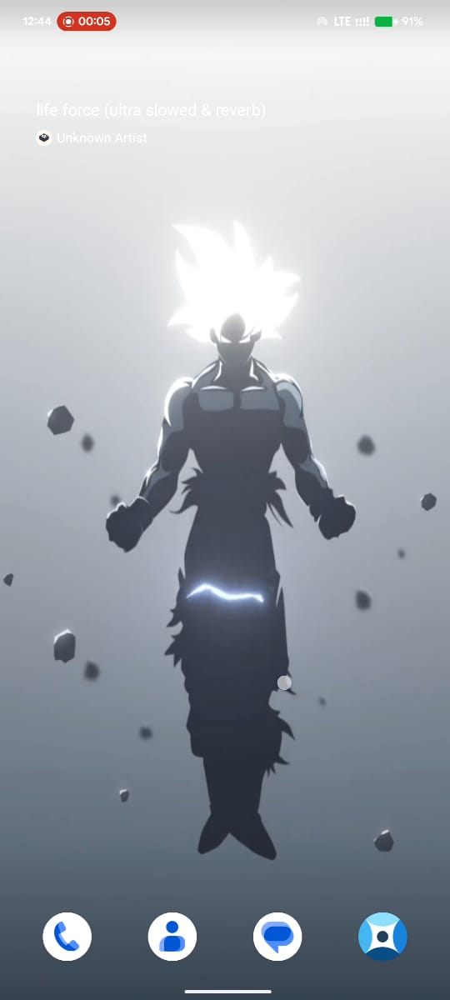
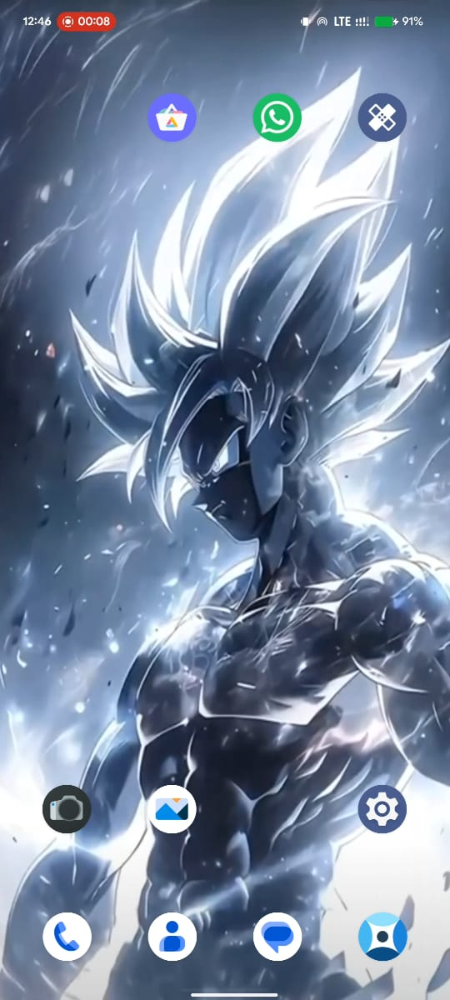
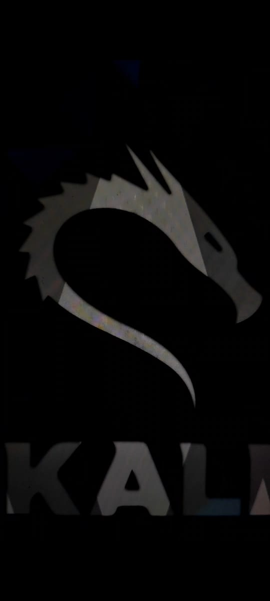
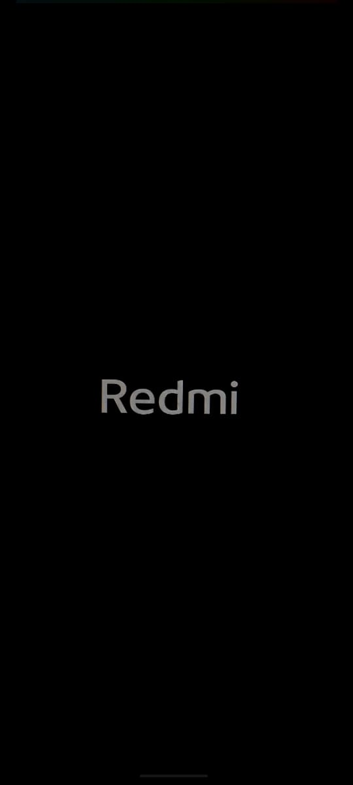
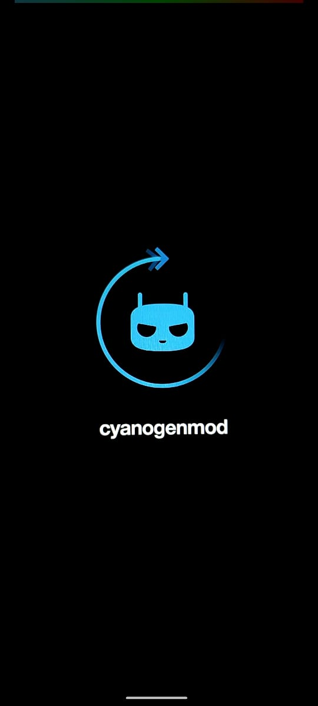

# 🎨 AURA CTRL — The Ultimate LSPosed Module

<h3>Complete Android Customization Suite</h3>

Pulse Animations • Status Bar Tweaks • List Animations • Boot Animations • Video Wallpaper • Gesture Triggers

[📥 Download Now](https://github.com/vaddempudignanesh/AURA-CTRL-LSPosed/releases/download/v2.0/AURA_CTRL_v2.0.apk) &nbsp;&nbsp; [📖 Documentation](#-features) &nbsp;&nbsp; [📹 Watch Demos](#-demo-videos)

---

## 🖼️ **VIDEO WALLPAPER**

Set any MP4 video as your live wallpaper with audio control

<table align="center">
  <tr>
    <td align="center"><b>🎬 Video Wallpaper Example 1</b></td>
    <td align="center"><b>🎬 Video Wallpaper Example 2</b></td>
  </tr>
  <tr>
    <td align="center">
      
    </td>
    <td align="center">
      
    </td>
  </tr>
</table>

---

## 🎬 **BOOT ANIMATIONS**

Contains 35+ boot animations with GIF previews - one-time download saves 200+ MB APK space!

**Row 1: Boot Animation Example 1**

<table align="center">
  <tr>
    <td align="center"><b>Boot Logo</b></td>
    <td align="center"><b>Boot Animation</b></td>
  </tr>
  <tr>
    <td align="center">
      
    </td>
    <td align="center">
      
    </td>
  </tr>
</table>

**Row 2: Boot Animation Example 2**

<table align="center">
  <tr>
    <td align="center"><b>Boot Logo</b></td>
    <td align="center"><b>Boot Animation</b></td>
  </tr>
  <tr>
    <td align="center">
      
    </td>
    <td align="center">
      
    </td>
  </tr>
</table>

> **Note:** All 35+ boot animations are available in the app with live GIF previews before applying!

---

## ✨ **FEATURES SHOWCASE**

---
